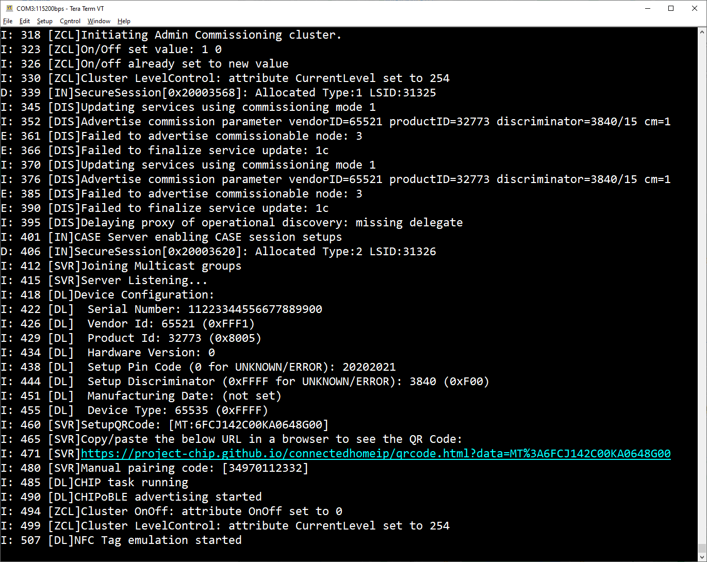

# Chapter 1 - Matter End Device
You can find all available Matter samples of the nRF Connect SDK under: [Matter samples](https://developer.nordicsemi.com/nRF_Connect_SDK/doc/2.3.0/nrf/samples/matter.html).

The complete app code of a Matter weather station is available under nRF Connect SDK [Applications](https://developer.nordicsemi.com/nRF_Connect_SDK/doc/2.3.0/nrf/applications/matter_weather_station/README.html).

## Step 1: Select a Matter sample application (e.g. Matter Light bulb)

Ensure that you have a compatible DK at hand.  
We will select the nRF52840-DK as device platform and the [Matter Light bulb](https://developer.nordicsemi.com/nRF_Connect_SDK/doc/2.3.0/nrf/samples/matter/light_bulb/README.html) example code. 

## Step 2: Create a new application under VS Code

Within VS Code, use the nRF Connect Extension to create a new freestanding application in your workspace directory of choice.

## Step 3: Add a build configuration

Add a build configuration to your newly created project to link the source code to the applicable hardware / Nordic Development Kit.  
Select the nRF52840-DK and keep the remaining settings on default for now.  
Hit **Build Configuration**, this will compile the complete source code.

## Step 4: Flash the compiled project to your nRF52840-DK

Connect your nRF52840 DK, a serial number should appear under Connected Devices within nRF Connect for VS Code.  
Hit **Flash** to program the kit.

## Step 5: Validate the firmware on the DK's terminal output
Expect a terminal / shell output via the Virtual COM port of your connected DK as follows.

> **Note**
> The Setup Pin Code and Setup Discriminator will be required for the commissioning process at the Matter controller later on.
