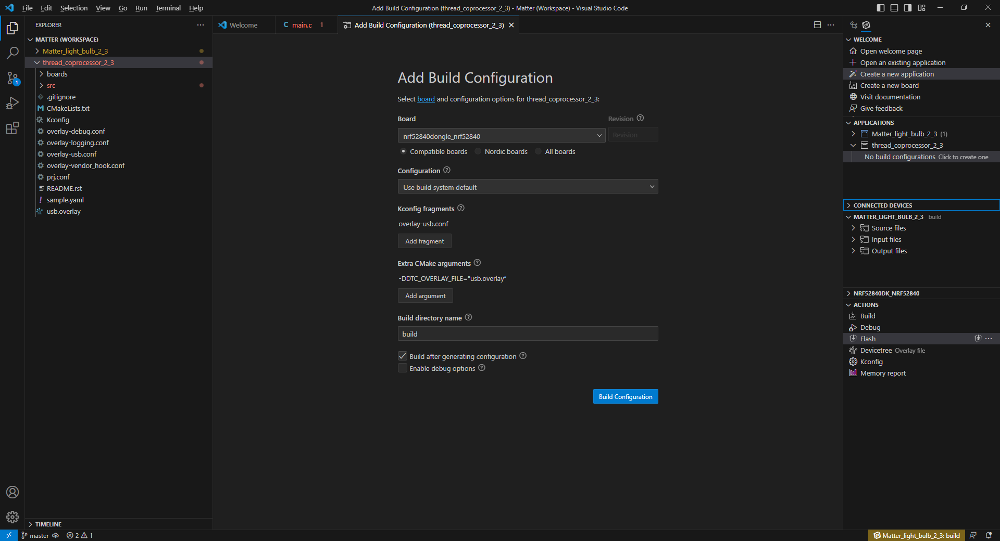
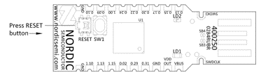
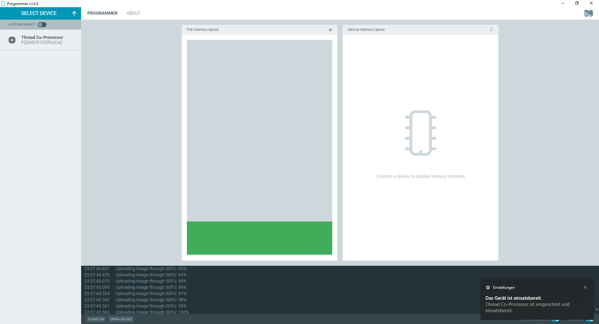

# Chapter 2A - Setup of a Thread RCP
> **Note**
> For Matter over WiFi projects, the Thread Border Router und thus Thread RCP is not needed. Chapter 2 can be skipped.

A Thread Radio Co Processor will be needed as Thread radio front end / dongle if the host hardware does not support Thread natively (this is the case for a Raspberry Pi or typical Linux x86 machines).<br>

We will use the nRF Connect tools and SDK to compile and program a Thread RCP firmware to the nRF52840 dongle.

### Step 1: Open VS Code and create a new application, search for "Thread coprocessor"

Use the sample project under ***nrf/samples/openthread/coprocessor*** <br>

Under create a new application, choose “Freestanding” as application type and select the nRF Connect SDK v2.3.0 as toolchain.

### Step 2: Build the RCP sample

### Step 3: Add a build configuration

1. Create a build configuration for the newly added project.
2. Select ***nrf52840dongle_nrf52840*** as Board
3. Under Kconfig fragments, select ```overlay-usb.conf``` and hit "OK"
4. Under Extra Cmake arguments add argument: ```-DDTC_OVERLAY_FILE="usb.overlay"``` and hit "OK"
5. Hit ***Build Configuration***



> **Note**
> The compiled Thread RCP firmware is found under: \build\zephyr\zephyr.hex

### Step 4: Put the nRF52840 dongle into DFU / Bootloader Mode

1. Connect the nRF52840 dongle to your USB port
2. Put the dongle into DFU / bootloader mode by pressing the reset button
   <br> 
4. The dongle is in DFU mode when LD2 (LED 2) pulses red.

### Step 5: Flash the nRF52840 Dongle
> **Note**
> We will flash the nRF52840 dongle using the nRF Programmer app, you can also use the command line with nrfutil.

1. Open nRF Connect for Desktop, open nRF Programmer
2. Select Device: The dongle should enumerate as **Open DFU Bootloader** when in DFU mode
3. Add the compiled Thread RCP firmware found under: **\build\zephyr\zephyr.hex**
4. Hit write to perform the flash process
5. Verify the progress through the nRF Programmer log. The device will automatically reset upon successful flash.
6. The device should now enumerate as ***Thread Co-Processor***


