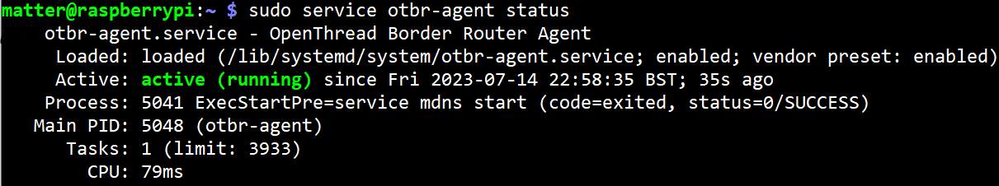

# Chapter 2B - Setup of the OpenThread Border Router (OTBR)
> **Warning**
> Ensure to use a 64 Bit OS for the Raspberry Pi 4. This will allow you to use the pre-compiled Matter controller later on.

We will setup the OTBR on a Raspberry Pi 4, using the 64 Bit Raspberry Pi OS. You may also use an Ubuntu Server image (20.04) if preferred. The selection of the OS may have dependencies when selecting pre-compiled tools such as the Matter controller.

### Step 1: Setup the Raspberry Pi and enable WiFi connectivity (+optionally SSH access)

Enter the configuration system.
```
sudo raspi-config
```

### Step 2: Update your Pi and install git

```
sudo apt update
sudo apt upgrade -y
sudo apt install git
```

### Step 3: Clone the OTBR Github repository

We will follow the documentation, accumulated from [Nordic](https://developer.nordicsemi.com/nRF_Connect_SDK/doc/2.3.0/nrf/protocols/thread/tools.html#installing-otbr-manually-raspberry-pi) 
and the [OpenThread Codelab Tutorial](https://openthread.io/codelabs/openthread-border-router#1)

```
git clone https://github.com/openthread/ot-br-posix.git --depth 1
```

### Step 4: Adjust the cloned repository

Following the Nordic documentation, make sure to check out the compatible commit id after cloning the repository.

```
cd ot-br-posix
git pull --unshallow
git checkout a892bf7
```

### Step 5: Build the OTBR using the bootstrap script
Inside ot-br-posix:
```
./script/bootstrap
```
### Step 6: Run the setup script with the connected IP interface (Ethernet or WiFi)

We are using Wifi, thus our IP interface is wlan0. (For ethernet connection, use eth0)
```
INFRA_IF_NAME=wlan0 ./script/setup
```

### Step 7: Reboot and check the OTBR installation / service

```
sudo reboot
```

After reboot, retrieve OTBR service status:

```
sudo service otbr-agent status
```

> **Note**
> It is expected that the service has exited and is auto-restarting/activating. This is due to no Thread Radio Front End being present (unless the Thread RCP dongle has been plugged in already).

### Step 8: Modify the UART baudrate for the Thread RCP
Assuming the nRF52840 dongle enumerates as ACM0, edit the following file
```
sudo nano /etc/default/otbr-agent
```

Edit the line to include **?uart-baudrate=1000000**
```
spinel+hdlc+uart:///dev/ttyACM0?uart-baudrate=1000000
```
### Step 9: Connect the nRF52840 dongle as Thread RCP

Insert the nRF52840 dongle to one of your Raspberry Pi's USB ports.

### Step 10: Restart the OTBR Service
```
sudo service otbr-agent restart
```

### Step 11: Verify that OTBR is now in status active (running)

```
sudo service otbr-agent status
```


