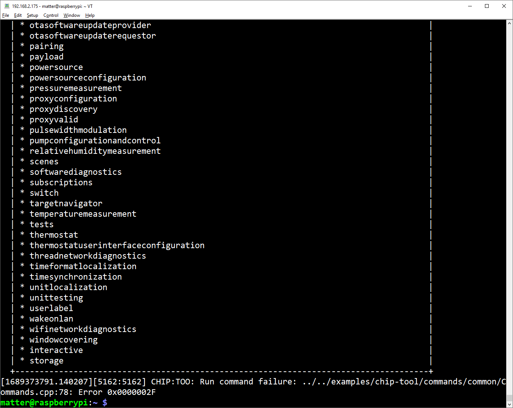

# Chapter 3 - Setup of the Matter Controller

The Matter controller will be the remaining essential component to form a functional Matter network. <br>
For simplicity we will use a pre-compiled Matter controller. 

At the release of almost every nRF Connect SDK version, Nordic also publishes a pre-compiled Matter controller, usually for Linux 64 Bit and ARM 64 Bit operating systems.<br>

You can find an overview of pre-compiled Matter controllers under [Nordic's GitHub](https://github.com/nrfconnect/sdk-connectedhomeip/releases/)

> **Note**
> The precompiled Matter controller is the reason why we needed to choose a specific OS and bit length for the Raspberry Pi. If you are building the Matter controller from source, you are more flexible in selecting the OS.

### Step 1: Download pre-compiled Matter Controller
We will download the pre-compiled Matter controller for ARM architecture, Linux 64 Bit Operating systems.

```
wget https://github.com/nrfconnect/sdk-connectedhomeip/releases/download/v2.3.0/chip-tool-linux_aarch64.zip
```

### Step 2: Unzip the Matter Controller
```
unzip chip-tool-linux_aarch64.zip
```

### Step 3: Test run the Matter Controller aka "CHIP Tool"
```
./chip-tool-debug
```
> **Note**
> A run command failure is expected, as the chip tool expects certain parameters to actually execute a command. You should see a list of all available chip tool commands, indicating that the Matter controller application works.



### Step 4: You can run the CHIP Tool interactively

Run the chip tool interactively (does not exit after initial call) with its shell.

```
./chip-tool-debug interactive start
```

Further information can be found in the [documentation](https://developer.nordicsemi.com/nRF_Connect_SDK/doc/2.3.0/matter/chip_tool_guide.html#supported-commands-and-options).
