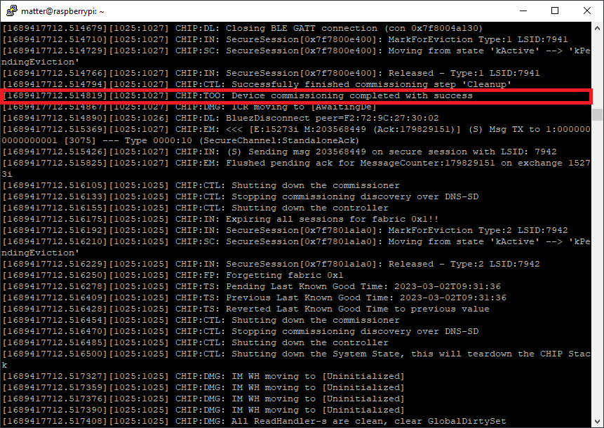

# Chapter 5 - Commissioning the End Device

Once all previous steps are completed, we are now ready to commission a Matter over Thread (or also Matter over WiFi) end device.

### Step 1: Start the Matter End Device and log the output

Note down the Setup Pin Code and the Setup discriminator. On all Nordic examples, these are by default configured to:

1. Setup pin code: ```20202021```
2. Setup Discriminator: ```3840 (0xF00)```

### Step 2: Start the BLE Advertising (if not started by default) on the Matter End Device

For the Matter Light bulb example, the BLE advertising is automatically started. Press Button 4 to enable advertising / validate this.

### Step 3: Commissioning into Thread network over BLE
To commission the device to the existing Thread network, use the following command pattern:

```
./chip-tool-debug pairing ble-thread <node_id> hex:<operational_dataset> <pin_code> <discriminator>
```

Where node id can be freely selected. <br>
We are selecting node id 1 here (node id 0 may be reserved depending on the used Matter controller). The pin code and discriminator are given from the end device configuration. The Thread dataset comes from the Thread Border Router.

This simplifies the command to:

```
./chip-tool-debug pairing ble-thread 1 hex:<operational_dataset> 20202021 3840
```
where ``<operational dataset>`` needs to be set to the output of command: ``sudo ot-ctl dataset active -x``<br>

A quickly running log output will indicate a working BLE communication between the Matter controller and the Matter end device. <br>
The fairly hidden message **Device commissioning completed with success** will indicate a succcess.



### Step 4: Verify Thread state on the Matter end device

You can verify the thread network interface and the state on the end device (nRF52840 DK) with the following commands:

```
ot ifconfig
ot state
```

> **Note**
> The OpenThread CLI is active when compiling the Matter sample in the default debug configuration. Your log output (VCOM port of the DK) acts also UART shell for the OT CLI. The shown commands are from the [Thread CLI sample](https://developer.nordicsemi.com/nRF_Connect_SDK/doc/2.3.0/nrf/samples/openthread/cli/README.html#testing).

You may also use 
```
ot help
```
for further guidance on possible CLI commands on the Matter over Thread end device.
