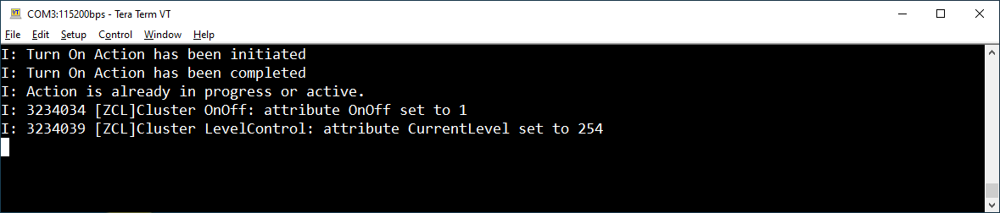

# Chapter 6 - Using the Matter Controller
In this chapter we will use the Matter controller aka CHIP Tool to control the Matter end device remotely.

Data & information is stored in so called application clusters. Access and controlling them is the key part of running the Matter network.

### Step 1: Control the end device's application cluster locally

With the Matter Light bulb sample application running on the Nordic DK (see [Chapter 1 - Matter End Device (Nordic DK as Matter Light Bulb)](./1_Matter_End_Device.md) on how to flash the Matter sample application.),
you can control (here toggle) the OnOff cluster using the DK's button 2. This will essentially toggle the LED 2 on the nRF52840 DK that represents our light bulb.

Verify:
```
[ZCL]Cluster OnOff: attribute OnOff set to 1
```



> **Note**
> You will also see the cluster LevelControl being read, its value 254 represents the maximum brightness.

### Step 2: Control the Matter light bulb remotely

In this step we will toggle the OnOff cluster remotely from the Matter controller. <br>
The command syntax is ``./chip-tool-debug onoff toggle destination-id endpoint-id`` where destination id is the destination node id and endpoint-id is the application cluster id.<br>

During the previous chapter we selected the node id ``1`` for our Matter light bulb (this is our destination id for this command). <br> 
The device's core application cluster is usually configured with id ``1``, wheras basic vendor and product information are reserved to be stored in application cluster with endpoint id 0. <br>
This is the case for our Matter light bulb sample application.

The following command toggles the LED 2 (represents the Matter Light bulb) on the Matter end device (our nRF52840 DK) remotely from the Matter controller.
```
./chip-tool-debug onoff toggle 1 1
```

### Step 3: Read the vendor name

You can run further commands to read or control Matter application clusters. The application cluster with id 0 is always supported, thus we can use it to retrieve information on the Matter end device.
Run
```
./chip-tool-debug
```

to see a list of all supported application clusters by the Matter controller. We can use for example: ``basicinformation``.

The following command is an example to read out the vendor name. <br>
Note that we query our Matter node with ``id 1`` (our Light bulb), but use the application cluster end point ``0`` in this case.

```
./chip-tool-debug basicinformation read vendor-name 1 0
```
