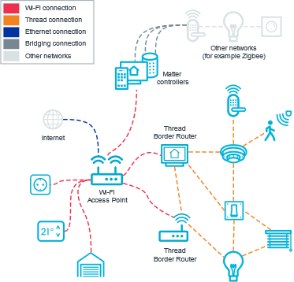
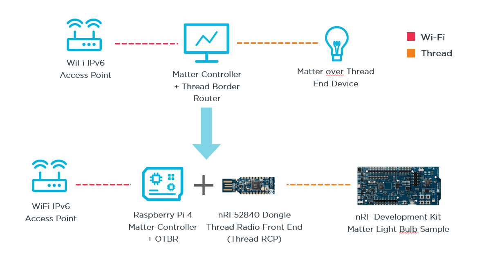
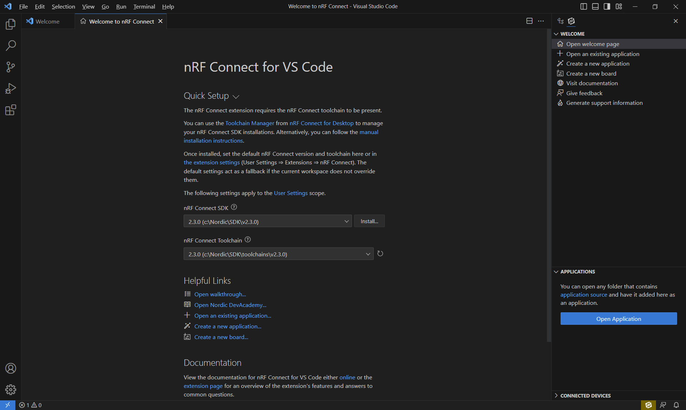

# Matter Workshop
This workshop guides you through the setup of a Matter network from scratch using Nordic SoCs and a Raspberry Pi.

 
You will need:

1. **Compatible Nordic development kit** (nRF52840-DK, nRF5340 DK, nRF7002-DK or nRF21540 DK)
2. **Raspberry Pi** (Model 3B or newer)
3. **nRF52840 dongle**   (alternatively another nRF525840-DK, find instructions for the Thread RCP on the DK [here](https://developer.nordicsemi.com/nRF_Connect_SDK/doc/2.3.0/nrf/protocols/thread/tools.html#configuring-a-radio-co-processor))

The aim is to setup a Matter over Thread network with current reference tools and implementations (Matter CHIP tool, OpenThread Border Router / OTBR). You may omit all Thread related chapters (2 and 4), if you wish to run a Matter over WiFi setup only.

> **Note**
> This guide uses the nRF Connect for Desktop Tools and nRF Connect SDK v2.3.0 !

Our Matter setup will look as follows (Thread Border Router + Matter Controller on a single device, here the Raspberry Pi).

## Prologue - Setting up the Development Environment
> **Note**
> A recommended setup video can be found online under: [nRF Connect for VS Code - Installation](https://www.youtube.com/watch?v=zcMCaODyISo)

We will follow the guided, and automated installation through nRF Connect for Desktop and will use the recommended IDE: Microsoft's VS Code.

**Step 1**: Download and install the following tools:
1. [nRF Command Line Tools](https://www.nordicsemi.com/Products/Development-tools/nrf-command-line-tools/download)
   - This should also install the required J-Link drivers for programming + debugging any Nordic Development Kits (DKs). Do so, if you don't have any previous J-Link drivers installed. If you cancel/abort this step, please install the latest J-Link driver manually (these can be found [here](https://www.segger.com/downloads/jlink/)).
2. [nRF Connect for Desktop](https://www.nordicsemi.com/Products/Development-tools/nRF-Connect-for-Desktop/Download)
   - The main desktop application acts as an umbrella for several tools, including the Toolchain Manager to install the SDK or the nRF Programmer to use for flashing an image to a Nordic device.
3. [Visual Studio Code](https://code.visualstudio.com/Download)
   - VS Code will be our preferred IDE. It will be extended with Nordic's plugins/extensions to enable a fully featured coding and debugging environment for Nordic + Zephyr RTOS projects.
  
**Step 2**: After installation of all three applications, please open nRF Connect for Desktop. **Install the Toolchain Manager** that is used for downloading and installing the nRF Connect SDK.

**Step 3**: Run the Toolchain Manager, **install the nRF Connect SDK v2.3.0** (as this version will be used in the workshop).
> **Newer SDK version available** You may use a newer SDK version, but keep in mind to then refer to the latest documentation and hyperlinks!

> **Warning**
> Ensure to use a basic directory name (no special characters!) and keep the installation directory close to the file system root!   This will ensure no further issues with scripts and the toolchain on heavily nested projects. I am using ***C:/Nordic/SDK***

**Step 4**: Open VS Code through the Toolchain Manager to detect missing extensions/plugins. **Install Nordic's VS Code extensions** (nRF Connect, nRF Terminal, nRF Konfig etc.) by clicking on install missing extensions. Note that you can also install those through the VS Code extensions tab when searching the extensions marketplace for nRF Connect for VS Code extension pack. Also note that you should be aware of conflicting extensions if you have used VS Code previously with other extensions.

**Step 5**: Run VS Code and **perform the Quick Setup on the nRF Connect extension**. Select the nRF Connect SDK and toolchain that matches your setup (here v2.3.0).

# Workshop - Table of Contents
### [Chapter 1 - Matter End Device (Nordic DK as Matter Light Bulb)](./1_Matter_End_Device.md)
### [Chapter 2A - Setup of a Thread RCP](./2A_Thread_RCP.md)
### [Chapter 2B - Setup of the OpenThread Border Router (OTBR)](./2B_ThreadBorderRouter.md)
### [Chapter 3 - Setup of the Matter Controller](./3_MatterController.md)
### [Chapter 4 - Running the OTBR to create a Thread network](./4_ThreadNetwork.md)
### [Chapter 5 - Commissioning the End Device](./5_Commissioning.md)
### [Chapter 6 - Using the Matter Controller](./6_UsingMatter.md)